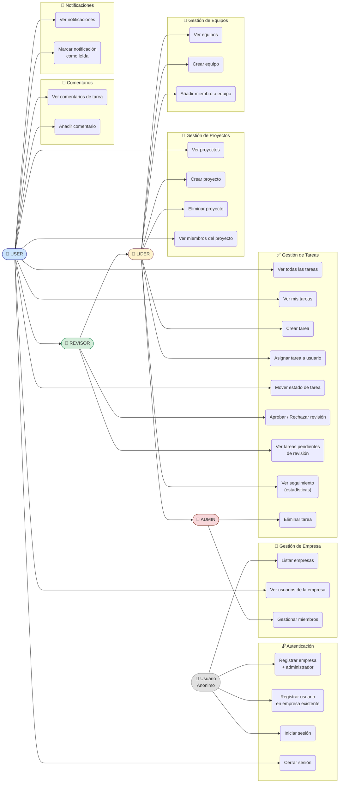

# CoFlow — Documentación del Proyecto

> Plataforma de gestión de proyectos y tareas multi-empresa con autenticación JWT, control de roles y flujo de trabajo completo.

---

## Índice

1. [Visión general](#1-visión-general)
2. [Arquitectura del sistema](#2-arquitectura-del-sistema)
3. [Tecnologías utilizadas](#3-tecnologías-utilizadas)
4. [Estructura del repositorio](#4-estructura-del-repositorio)
5. [Backend (backend-v2)](#5-backend-backend-v2)
   - 5.1 [Configuración y arranque](#51-configuración-y-arranque)
   - 5.2 [Modelo de datos](#52-modelo-de-datos)
   - 5.3 [Capas de la aplicación](#53-capas-de-la-aplicación)
   - 5.4 [Seguridad y autenticación](#54-seguridad-y-autenticación)
   - 5.5 [API REST — Endpoints](#55-api-rest--endpoints)
   - 5.6 [Tests unitarios](#56-tests-unitarios)
6. [Frontend (frontend-web)](#6-frontend-frontend-web)
   - 6.1 [Configuración y arranque](#61-configuración-y-arranque)
   - 6.2 [Estructura de carpetas](#62-estructura-de-carpetas)
   - 6.3 [Gestión de autenticación](#63-gestión-de-autenticación)
   - 6.4 [Rutas y navegación](#64-rutas-y-navegación)
   - 6.5 [Servicios y comunicación con la API](#65-servicios-y-comunicación-con-la-api)
   - 6.6 [Tipos compartidos (TypeScript)](#66-tipos-compartidos-typescript)
7. [Despliegue con Docker](#7-despliegue-con-docker)
8. [Variables de entorno](#8-variables-de-entorno)
9. [Flujo de trabajo de tareas](#9-flujo-de-trabajo-de-tareas)
10. [Casos de uso del usuario](#10-casos-de-uso-del-usuario)

---

## 1. Visión general

**CoFlow** es una aplicación web de gestión de proyectos orientada a equipos de trabajo dentro de una empresa. Permite:

- Registrar empresas y gestionar sus usuarios con distintos roles.
- Crear proyectos y asignarlos a equipos.
- Gestionar tareas con un ciclo de vida completo (pendiente → asignada → en proceso → revisión → completada).
- Añadir comentarios a las tareas.
- Recibir notificaciones internas.

La aplicación sigue una arquitectura **cliente-servidor** desacoplada: un backend REST en Spring Boot y un frontend SPA en React, desplegables de forma conjunta mediante Docker Compose.

---

## 2. Arquitectura del sistema

```
┌───────────────────┐        HTTP/JSON        ┌──────────────────────────────┐
│  Browser (React)  │  ─────────────────────▶  │  Spring Boot API (port 8080) │
│  port 5173        │  ◀─────────────────────  │  backend-v2                  │
└───────────────────┘     JWT en header         └──────────────┬───────────────┘
                                                               │
                                                               │ JPA / JDBC
                                                               ▼
                                                  ┌────────────────────────┐
                                                  │  MySQL 8+              │
                                                  │  Base de datos: coflow │
                                                  └────────────────────────┘
```

> **Nota:** El `docker-compose.yml` actual levanta un contenedor PostgreSQL para el `backend` (versión anterior). El `backend-v2` usa MySQL y requiere una instancia MySQL accesible según la cadena de conexión de `application.properties`.

---

## 3. Tecnologías utilizadas

### Backend

| Tecnología | Versión | Uso |
|---|---|---|
| Java | 17 | Lenguaje de programación |
| Spring Boot | 3.2.5 | Framework principal |
| Spring Security | 6.x | Autenticación y autorización |
| Spring Data JPA / Hibernate | 6.x | ORM y acceso a datos |
| MySQL Connector/J | (managed) | Driver JDBC para MySQL |
| JJWT (io.jsonwebtoken) | 0.11.5 | Generación y validación de tokens JWT |
| Lombok | (managed) | Reducción de boilerplate |
| Maven | 3.x | Gestor de dependencias y build |
| JUnit 5 / Mockito | (managed) | Tests unitarios |

### Frontend

| Tecnología | Versión | Uso |
|---|---|---|
| React | 18.3.1 | UI library |
| TypeScript | 5.7.3 | Tipado estático |
| Vite | 6.1.0 | Bundler y servidor de desarrollo |
| React Router DOM | 6.30.1 | Enrutamiento SPA |
| Bootstrap | 5.3.6 | Framework CSS |

### Infraestructura

| Tecnología | Uso |
|---|---|
| Docker / Docker Compose | Contenedorización y orquestación |
| Nginx (en imagen frontend) | Servidor estático para producción |

---

## 4. Estructura del repositorio

```
coflow-tfc/
├── docker-compose.yml          # Orquestación de contenedores
├── backend-v2/                 # Backend Spring Boot (versión actual)
│   ├── pom.xml
│   └── src/
│       ├── main/
│       │   ├── java/com/example/backend_v2/
│       │   │   ├── BackendV2Application.java
│       │   │   ├── config/       # Seguridad, JWT filter, inicialización de datos
│       │   │   ├── controller/   # Controladores REST
│       │   │   ├── dto/          # Objetos de transferencia de datos
│       │   │   ├── model/
│       │   │   │   ├── entity/   # Entidades JPA
│       │   │   │   └── enums/    # Enumeraciones de dominio
│       │   │   ├── repository/   # Interfaces Spring Data JPA
│       │   │   └── service/      # Lógica de negocio
│       │   └── resources/
│       │       ├── application.properties
│       │       └── schema.sql    # DDL de la base de datos
│       └── test/
│           └── java/com/example/backend_v2/
│               └── service/      # Tests unitarios de servicios
└── frontend-web/               # SPA React + TypeScript
    ├── Dockerfile
    ├── index.html
    ├── package.json
    ├── vite.config.ts
    └── src/
        ├── auth/               # Contexto de autenticación
        ├── components/         # Componentes reutilizables
        ├── pages/              # Páginas de la aplicación
        ├── routes/             # Definición de rutas
        ├── services/           # Llamadas a la API REST
        └── types/              # Tipos e interfaces TypeScript
```

---

## 5. Backend (backend-v2)

### 5.1 Configuración y arranque

**Prerrequisitos:**
- Java 17+
- Maven 3.x
- MySQL 8+ en ejecución con la base de datos `coflow` creada

**Configuración (`src/main/resources/application.properties`):**

```properties
spring.datasource.url      = jdbc:mysql://localhost:3306/coflow
spring.datasource.username = root
spring.datasource.password = root
spring.jpa.hibernate.ddl-auto = update
spring.sql.init.mode = never

jwt.secret.key     = <clave-hexadecimal-de-256-bits>
jwt.expiration.ms  = 86400000
```

**Arranque local:**

```bash
cd backend-v2
./mvnw spring-boot:run
```

La aplicación queda disponible en `http://localhost:8080`.

---

### 5.2 Modelo de datos

El esquema está definido en `src/main/resources/schema.sql` y es específico de **MySQL** (`ENGINE=InnoDB`, `AUTO_INCREMENT`, `SET FOREIGN_KEY_CHECKS`).

#### Diagrama entidad-relación

```
empresa ──< usuario
   │
   └──< proyecto ──< tarea ──< comentario
            │            │
            │            └──< tarea_usuario (asignaciones)
            │
         equipo ──< equipo_usuario
            │
         proyecto_usuario

usuario ──< notificacion
```

#### Tablas principales

| Tabla | Descripción |
|---|---|
| `empresa` | Organización propietaria de los proyectos |
| `usuario` | Miembro de la empresa con rol asignado |
| `proyecto` | Proyecto vinculado a una empresa y un equipo |
| `equipo` | Grupo de usuarios asociado a un proyecto |
| `tarea` | Unidad de trabajo dentro de un proyecto |
| `comentario` | Comentario de un usuario sobre una tarea |
| `notificacion` | Notificación interna para un usuario |
| `tarea_usuario` | Relación N:M entre tareas y usuarios asignados |
| `equipo_usuario` | Relación N:M entre equipos y usuarios |
| `proyecto_usuario` | Relación N:M entre proyectos y usuarios |

#### Enumeraciones de dominio

| Enum | Valores |
|---|---|
| `RolUsuario` | `ADMIN`, `LIDER`, `REVISOR`, `USER` |
| `EstadoTarea` | `PENDIENTE`, `ASIGNADA`, `EN_PROCESO`, `BLOQUEADA`, `EN_REVISION`, `APROBADA`, `RECHAZADA`, `COMPLETADA` |
| `Prioridad` | `BAJA`, `MEDIA`, `ALTA`, `URGENTE` |
| `TipoComentario` | (tipo de comentario en tarea) |

---

### 5.3 Capas de la aplicación

La aplicación sigue una arquitectura **en capas** clásica:

```
Controller  →  Service  →  Repository  →  Base de datos
     ↕              ↕
    DTO          Entity
```

| Paquete | Responsabilidad |
|---|---|
| `controller` | Recibe peticiones HTTP, valida y delega en servicios |
| `service` | Contiene la lógica de negocio |
| `repository` | Interfaces JPA para acceso a datos |
| `model/entity` | Entidades mapeadas a tablas de base de datos |
| `model/enums` | Enumeraciones de dominio |
| `dto` | Objetos de entrada (`*Request`) y de salida (`*DTO`, `*Response`) |
| `config` | Configuración de seguridad, filtros JWT e inicialización |

#### Servicios implementados

| Servicio | Descripción |
|---|---|
| `AuthService` | Registro de empresa+admin, registro de usuario, login |
| `JwtService` | Generación, extracción de claims y validación de tokens JWT |
| `CustomUserDetailsService` | Implementación de `UserDetailsService` para Spring Security |
| `EmpresaService` | CRUD de empresas y sus miembros |
| `ProyectoService` | Creación y consulta de proyectos, gestión de miembros |
| `EquipoService` | Gestión de equipos y asignación de usuarios |
| `TareaService` | Ciclo de vida completo de tareas, asignación, cambios de estado, revisión |
| `ComentarioService` | Creación y consulta de comentarios por tarea |
| `NotificacionService` | Envío y lectura de notificaciones |
| `UsuarioService` | Consulta y gestión de usuarios de la empresa |

---

### 5.4 Seguridad y autenticación

La autenticación se basa en **JWT (JSON Web Tokens)** con arquitectura sin estado (stateless).

**Flujo:**

```
1. Cliente  →  POST /api/auth/login  →  {email, password}
2. Backend  →  valida credenciales con Spring Security
3. Backend  →  genera JWT firmado con HMAC-SHA256
4. Cliente  →  almacena token y lo adjunta en cada petición
               como cabecera: Authorization: Bearer <token>
5. Backend  →  JwtAuthenticationFilter intercepta y valida el token
               antes de llegar al controlador
```

**Rutas públicas (sin autenticación):**

| Método | Ruta |
|---|---|
| `POST` | `/api/auth/login` |
| `POST` | `/api/auth/register` |
| `POST` | `/api/auth/register-company` |
| `GET` | `/api/empresas` |

Todas las demás rutas requieren `Authorization: Bearer <token>`.

**CORS configurado** para `http://localhost:*` (cualquier puerto local), con soporte de credenciales.

---

### 5.5 API REST — Endpoints

Todas las respuestas siguen el envelope estándar:

```json
{
  "success": true,
  "message": "Descripción",
  "data": { ... }
}
```

#### Autenticación — `/api/auth`

| Método | Ruta | Descripción | Auth |
|---|---|---|---|
| `POST` | `/api/auth/login` | Login con email y contraseña | No |
| `POST` | `/api/auth/register` | Registro de usuario en empresa existente | No |
| `POST` | `/api/auth/register-company` | Registro de empresa + admin | No |

#### Empresas — `/api/empresas`

| Método | Ruta | Descripción | Auth |
|---|---|---|---|
| `GET` | `/api/empresas` | Listar todas las empresas | No |
| `GET` | `/api/empresas/{id}` | Obtener empresa por ID | Sí |
| `GET` | `/api/empresas/{id}/usuarios` | Usuarios de la empresa | Sí |

#### Proyectos — `/api/proyectos`

| Método | Ruta | Descripción |
|---|---|---|
| `GET` | `/api/proyectos` | Listar todos los proyectos |
| `GET` | `/api/proyectos/{id}` | Obtener proyecto por ID |
| `POST` | `/api/proyectos` | Crear nuevo proyecto |
| `GET` | `/api/proyectos/{id}/miembros` | Miembros del proyecto |
| `DELETE` | `/api/proyectos/{id}` | Eliminar proyecto |

#### Tareas — `/api/tareas`

| Método | Ruta | Descripción |
|---|---|---|
| `GET` | `/api/tareas` | Listar todas las tareas |
| `GET` | `/api/tareas/{id}` | Obtener tarea por ID |
| `GET` | `/api/tareas/proyecto/{proyectoId}` | Tareas de un proyecto |
| `GET` | `/api/tareas/mis-tareas` | Tareas asignadas al usuario autenticado |
| `GET` | `/api/tareas/pendientes-revision` | Tareas en revisión pendiente |
| `GET` | `/api/tareas/seguimiento` | Estadísticas de seguimiento (mapa estado → cantidad) |
| `POST` | `/api/tareas` | Crear nueva tarea |
| `PATCH` | `/api/tareas/{id}/asignar` | Asignar tarea a un usuario |
| `PATCH` | `/api/tareas/{id}/estado` | Aceptar o rechazar una tarea |
| `PATCH` | `/api/tareas/{id}/mover` | Mover tarea a otro estado |
| `POST` | `/api/tareas/{id}/decision` | Registrar decisión de revisión (aprobar/rechazar) |
| `DELETE` | `/api/tareas/{id}` | Eliminar tarea |

#### Comentarios — `/api/comentarios`

| Método | Ruta | Descripción |
|---|---|---|
| `GET` | `/api/comentarios/tarea/{tareaId}` | Comentarios de una tarea |
| `POST` | `/api/comentarios` | Crear comentario en una tarea |

#### Notificaciones — `/api/notificaciones`

| Método | Ruta | Descripción |
|---|---|---|
| `GET` | `/api/notificaciones` | Notificaciones del usuario autenticado |
| `PATCH` | `/api/notificaciones/{id}/leer` | Marcar notificación como leída |

#### Usuarios — `/api/usuarios`

| Método | Ruta | Descripción |
|---|---|---|
| `GET` | `/api/usuarios` | Listar usuarios de la empresa |
| `GET` | `/api/usuarios/{id}` | Obtener usuario por ID |

#### Equipos — `/api/equipos`

| Método | Ruta | Descripción |
|---|---|---|
| `GET` | `/api/equipos` | Listar equipos |
| `POST` | `/api/equipos` | Crear equipo |
| `POST` | `/api/equipos/{id}/miembros` | Añadir miembro a un equipo |

---

### 5.6 Tests unitarios

Los tests están ubicados en `src/test/java/com/example/backend_v2/service/` y cubren la lógica de negocio usando **JUnit 5** y **Mockito**.

| Clase de test | Qué prueba |
|---|---|
| `AuthServiceTest` | Registro de usuario, registro de empresa, login correcto e incorrecto |
| `JwtServiceTest` | Generación de token, extracción del username, validación y expiración |
| `ProyectoServiceTest` | Creación de proyecto, búsqueda por ID, listado, eliminación |
| `TareaServiceTest` | Creación, asignación, cambios de estado, flujo de revisión |

**Ejecutar los tests:**

```bash
cd backend-v2
./mvnw test
```

---

## 6. Frontend (frontend-web)

### 6.1 Configuración y arranque

**Prerrequisitos:**
- Node.js 18+
- npm 9+

**Instalación y arranque en desarrollo:**

```bash
cd frontend-web
npm install
npm run dev
```

La aplicación queda disponible en `http://localhost:5173`.

**Build de producción:**

```bash
npm run build
```

El resultado se genera en `dist/` y puede servirse con Nginx o cualquier servidor estático.

---

### 6.2 Estructura de carpetas

```
src/
├── auth/
│   ├── AuthProvider.tsx    # Contexto global de autenticación
│   └── constants.ts        # Constantes (URL base de la API, claves localStorage)
├── components/
│   └── DefaultLayout.tsx   # Layout con navbar para páginas protegidas
├── pages/
│   ├── Login.tsx           # Página de inicio de sesión
│   ├── SignUp.tsx          # Página de registro (usuario o empresa)
│   ├── MainPage.tsx        # Página principal (proyectos, tareas, comentarios)
│   └── ProtectedRoute.tsx  # Guardia de rutas autenticadas
├── routes/
│   └── Routes.tsx          # Definición del enrutador
├── services/
│   ├── apiClient.ts        # Cliente Axios/Fetch centralizado con interceptores
│   ├── authService.ts      # Login, registro, gestión de token en localStorage
│   ├── proyectoService.ts  # Llamadas a /api/proyectos
│   ├── tareaService.ts     # Llamadas a /api/tareas
│   ├── comentarioService.ts# Llamadas a /api/comentarios
│   └── empresaService.ts   # Llamadas a /api/empresas
└── types/
    └── types.ts            # Interfaces y tipos TypeScript globales
```

---

### 6.3 Gestión de autenticación

La autenticación se gestiona mediante un **React Context** (`AuthContext`) provisto por `AuthProvider`.

**Estado expuesto:**

| Propiedad | Tipo | Descripción |
|---|---|---|
| `isAuthenticated` | `boolean` | Si hay sesión activa |
| `user` | `LoginResponse \| null` | Datos del usuario autenticado |
| `token` | `string \| null` | JWT actual |
| `login(email, password)` | `Promise<void>` | Inicia sesión y persiste en `localStorage` |
| `signup(...)` | `Promise<void>` | Registra un nuevo usuario |
| `logout()` | `void` | Cierra sesión y limpia `localStorage` |

Al montar la aplicación, `AuthProvider` recupera automáticamente el token y los datos de usuario almacenados en `localStorage` para restaurar la sesión entre recargas.

---

### 6.4 Rutas y navegación

| Ruta | Componente | Acceso |
|---|---|---|
| `/login` | `Login` | Público |
| `/signup` | `SignUp` | Público |
| `/` | Redirección a `/main` | Protegido |
| `/main` | `MainPage` | Protegido (requiere token) |

`ProtectedRoute` comprueba `isAuthenticated`; si no hay sesión, redirige automáticamente a `/login`.

---

### 6.5 Servicios y comunicación con la API

Todos los servicios utilizan un cliente HTTP centralizado (`apiClient.ts`) que adjunta automáticamente el header `Authorization: Bearer <token>` en cada petición al recuperarlo de `localStorage`.

| Servicio | Funciones principales |
|---|---|
| `authService` | `login`, `signup`, `registerCompany`, `saveToken`, `getStoredToken`, `saveUser`, `getSavedUser`, `logout` |
| `proyectoService` | `getAll`, `getById`, `create`, `getMiembros`, `deleteById` |
| `tareaService` | `getAll`, `getByProyecto`, `getMisTareas`, `create`, `asignar`, `moverEstado`, `decidirRevision`, `getSeguimiento` |
| `comentarioService` | `getByTarea`, `create` |
| `empresaService` | `getAll`, `getById`, `getUsuarios` |

---

### 6.6 Tipos compartidos (TypeScript)

Definidos en `src/types/types.ts`, tipan todas las respuestas de la API y las peticiones del cliente.

**Principales interfaces:**

```typescript
ApiResponse<T>          // Envelope estándar de la API
LoginResponse           // Respuesta del login con token y datos de usuario
Proyecto / ProyectoCreateRequest
Tarea / TareaCreateRequest / AsignacionRequest
CambioEstadoRequest / MoverEstadoRequest / DecisionRevisionRequest
Comentario / ComentarioCreateRequest
UsuarioResumido
```

**Tipos enumerados:**

```typescript
type EstadoTarea  = 'PENDIENTE' | 'ASIGNADA' | 'EN_PROCESO' | 'BLOQUEADA'
                 | 'EN_REVISION' | 'APROBADA' | 'RECHAZADA' | 'COMPLETADA';
type Prioridad    = 'BAJA' | 'MEDIA' | 'ALTA' | 'URGENTE';
type RolUsuario   = 'ADMIN' | 'LIDER' | 'REVISOR' | 'USER';
```

---

## 7. Despliegue con Docker

> **Nota:** El `docker-compose.yml` actual está configurado para el `backend` (versión anterior con PostgreSQL) y el `frontend-web`. Para desplegar el `backend-v2` con Docker habría que añadir su servicio al compose y una instancia MySQL.

**Levantar el stack (backend v1 + frontend):**

```bash
docker-compose up --build
```

**Servicios del compose:**

| Servicio | Imagen/Build | Puerto local | Descripción |
|---|---|---|---|
| `db` | `postgres:15-alpine` | `5433` | Base de datos PostgreSQL (backend v1) |
| `backend` | `./backend` | `8080` | API Spring Boot (versión 1) |
| `frontend` | `./frontend-web` | `5173` | SPA React servida por Nginx |

**Variables de entorno utilizadas en producción (backend):**

| Variable | Valor de ejemplo |
|---|---|
| `DATABASE_URL` | `jdbc:postgresql://db:5432/coflow_db` |
| `DATABASE_USERNAME` | `coflow_user` |
| `DATABASE_PASSWORD` | `coflow_pass` |
| `JWT_SECRET` | Clave aleatoria ≥ 256 bits |
| `CORS_ALLOWED_ORIGINS` | `http://localhost,http://localhost:5173` |

---

## 8. Variables de entorno

### backend-v2 (`application.properties`)

| Propiedad | Descripción | Valor por defecto |
|---|---|---|
| `spring.datasource.url` | URL JDBC de MySQL | `jdbc:mysql://localhost:3306/coflow` |
| `spring.datasource.username` | Usuario MySQL | `root` |
| `spring.datasource.password` | Contraseña MySQL | `root` |
| `spring.jpa.hibernate.ddl-auto` | Estrategia DDL de Hibernate | `update` |
| `jwt.secret.key` | Clave secreta JWT (hex 256-bit) | *(obligatoria)* |
| `jwt.expiration.ms` | Tiempo de expiración del token (ms) | `86400000` (24h) |

### frontend-web

La URL base de la API se configura en `src/auth/constants.ts`. Por defecto apunta a `http://localhost:8080`.

---

## 9. Flujo de trabajo de tareas

Las tareas siguen un ciclo de vida controlado por el backend. El diagrama de transiciones de estado es el siguiente:

```
PENDIENTE
    │
    ▼ (asignar)
ASIGNADA
    │
    ▼ (aceptar)
EN_PROCESO ──────────────────────────┐
    │                                 │
    ▼ (mover a revisión)              │
EN_REVISION                          │
    │                                 │
    ├──▶ APROBADA ──▶ COMPLETADA      │
    │                                 │
    └──▶ RECHAZADA ───────────────────┘
    
EN_PROCESO / ASIGNADA ──▶ BLOQUEADA
```

**Roles y permisos sobre tareas:**

| Acción | Rol requerido |
|---|---|
| Crear tarea | `ADMIN`, `LIDER` |
| Asignar tarea | `ADMIN`, `LIDER` |
| Mover estado | Usuario asignado |
| Aprobar/Rechazar revisión | `REVISOR`, `LIDER`, `ADMIN` |
| Eliminar tarea | `ADMIN` |

---

## 10. Casos de uso del usuario

El diagrama muestra las acciones que puede realizar cada actor del sistema según su rol.



### Descripción de actores

| Actor | Descripción |
|---|---|
| **Usuario Anónimo** | Cualquier visitante sin sesión. Solo puede consultar empresas, registrarse o iniciar sesión. |
| **USER** | Usuario autenticado. Puede ver proyectos, gestionar sus propias tareas, comentar y recibir notificaciones. |
| **REVISOR** | Extiende USER. Puede revisar tareas y tomar decisiones de aprobación/rechazo. |
| **LIDER** | Extiende REVISOR. Crea y gestiona proyectos, equipos y asigna tareas al equipo. |
| **ADMIN** | Extiende LIDER. Control total: gestiona miembros de la empresa y puede eliminar cualquier tarea. |
